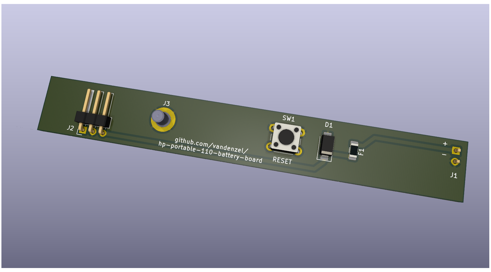

# HP Portable 110 Battery Board

A replacement board to stick onto the battery pack of a HP Portable 110 computer. But with some SMD parts. Also the 3 pin header should be a locking/latching part instead of "just" a pin header.

I didn't have a 3D image for the F1 fuse, or the J3 stud.

## Parts list

On PCB

| Part | Description             | Notes                                                                           |
| ---- | ----------------------- | ------------------------------------------------------------------------------- |
| D1   | 1N4001                  | this should be a D_SMA package                                                  |
| F1   | 0.5A                    | [Mouser](https://mou.sr/42zEMhM)                                                                            |
| J1   | header 1x2 2.54mm pitch | pinheader, or JST-XH, or wires soldered directly to PCB                         |
| J2   | header 1x3 2.54mm pitch | plain pinheader or something compatible with the locking connector              |
| J3   | screw terminal          | Press-fit M3 stud 6mm long ([PEM KFH-M3-6ET at Mouser](https://mou.sr/3RKMalD)) |
| SW1  | Reset switch            | Tact switch                                                                     |

External to PCB

| Part | Description                | Notes                                                 |
| ---- | -------------------------- | ----------------------------------------------------- |
| BT'1 | 6V 2.5Ah Lead Acid battery | i.e. LP 6-2.8 VRLA AGM Battery                        |
| J'1  | 1x02 2.54 pitch (female)   | could be omitted and wires soldered directly to board |

The battery usually has spade connectors, and the amperage is not really high, so basically any wire with a spade (a.k.a AMP) connector can be used. To connect it to the circuit board you can use a pinheader (like in the image), or a (2.54mm pitch) JST-XH connector, or just solder the wire to the respective holes.

If all goes well, the circuit board can be stuck to the battery using a piece of double sided, foam core sticky tape. Foam core to allow for the through-hole pins. Before sticking it on, check the fit in the battery compartment of the Portable 110.

## Dependencies:

- KiCad (obviously), version 8.0 or later.
- The [Fabrication Toolkit](https://github.com/bennymeg/Fabrication-Toolkit) plugin for KiCad.

